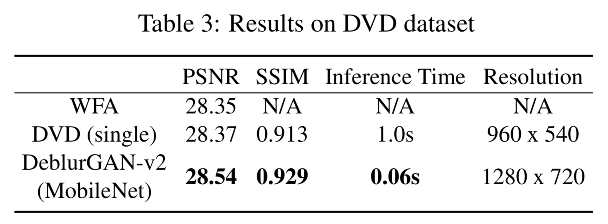
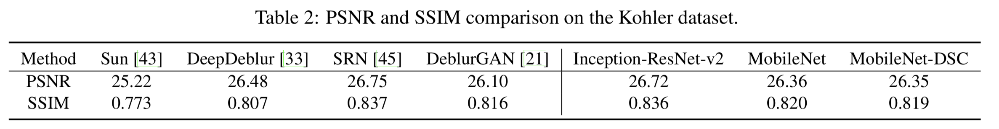
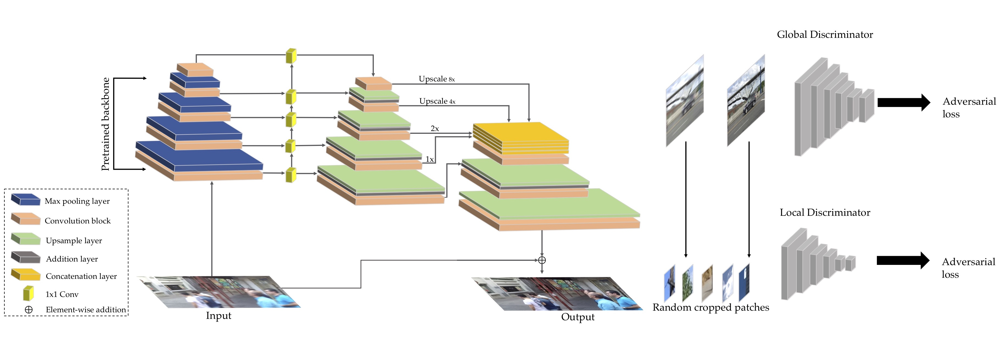
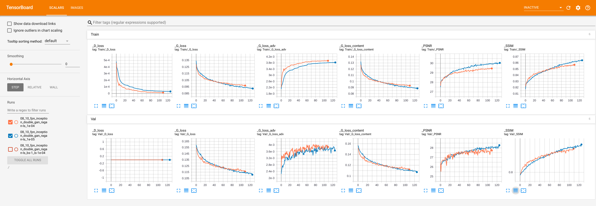

# DeblurGAN-v2 (Customize): Deblurring (Orders-of-Magnitude) Faster and Better


## Overview

DeblurGAN-v2 is a end-to-end generative adversarial network (GAN) designed for motion deblurring in single images. It improves efficiency, quality, and flexibility compared to previous methods. The model is built on a relativistic conditional GAN with a dual-scale discriminator.

With powerful backbones like Inception-ResNet-v2, DeblurGAN-v2 achieves high-quality deblurring, while lightweight options like MobileNet allow processing speeds up to 100 times faster than competitors, enabling real-time video deblurring.

Experiments show that DeblurGAN-v2 performs well on multiple benchmarks, achieving strong results in both objective and subjective deblurring quality while maintaining high efficiency. Additionally, the architecture proves effective for general image restoration tasks.

<!---We also study the effect of DeblurGAN-v2 on the task of general image restoration - enhancement of images degraded 
jointly by noise, blur, compression, etc. The picture below shows the visual quality superiority of DeblurGAN-v2 with 
Inception-ResNet-v2 backbone over DeblurGAN. It is drawn from our new synthesized Restore Dataset 
(refer to Datasets subsection below).-->

.png)
.png)

# Performance and efficiency comparison on the GoPro test dataset  
_All models were tested on the **linear** image subset._

| Model                | PSNR  | SSIM  | Time   | FLOPS      |
|----------------------|-------|-------|--------|------------|
| DeepDeblur          | 29.23 | 0.916 | 4.33s  | 1760.04G   |
| SRN                 | **30.10** | **0.932** | 1.6s   | 1434.82G   |
| DeblurGAN           | 28.70 | 0.927 | 0.85s  | 678.29G    |
| Inception-ResNet-v2 | 29.55 | **0.934** | 0.35s  | 411.34G    |
| MobileNet           | 28.17 | 0.925 | 0.06s  | 43.75G     |
| MobileNet-DSC       | 28.03 | 0.922 | **0.04s**  | **14.83G**  |

# Average subjective scores of deblurring results on the Lai dataset  

| Model                                      | DeepDeblur [33] | SRN [45] | DeblurGAN [21] | DeblurGAN-v2 (Inception-ResNet-v2) | DeblurGAN-v2 (MobileNet) | DeblurGAN-v2 (MobileNet-DSC) |
|--------------------------------------------|-----------------|----------|---------------|----------------------------------|--------------------------|------------------------------|
| **Score**                                  | 1.08            | 1.68     | 1.29          | **1.74**                         | 1.44                     | 1.32                         |

<!----->
<!----->

## DeblurGAN-v2 Architecture



<!---Our architecture consists of an FPN backbone from which we take five final feature maps of different scales as the 
output. Those features are later up-sampled to the same 1/4 input size and concatenated into one tensor which contains 
the semantic information on different levels. We additionally add two upsampling and convolutional layers at the end of 
the network to restore the original image size  and reduce artifacts. We also introduce a direct skip connection from 
the input to the output, so that the learning focuses on the residue. The input images are normalized to \[-1, 1\].
 e also use a **tanh** activation layer to keep the output in the same range.-->

<!---The new FPN-embeded architecture is agnostic to the choice of feature extractor backbones. With this plug-and-play 
property, we are entitled with the flexibility to navigate through the spectrum of accuracy and efficiency. 
By default, we choose ImageNet-pretrained backbones to convey more semantic-related features.--> 

## Datasets

The datasets for training can be downloaded via the links below:
- [DVD](https://drive.google.com/file/d/1bpj9pCcZR_6-AHb5aNnev5lILQbH8GMZ/view)
- [GoPro](https://drive.google.com/file/d/1KStHiZn5TNm2mo3OLZLjnRvd0vVFCI0W/view)
- [NFS](https://drive.google.com/file/d/1Ut7qbQOrsTZCUJA_mJLptRMipD8sJzjy/view)

## Training

#### Command

```python train.py```

training script will load config under config/config.yaml

#### Tensorboard visualization



## Testing

To test on a single image,

```python predict.py IMAGE_NAME.jpg```

By default, the name of the pretrained model used by Predictor is 'best_fpn.h5'. One can change it in the code ('weights_path' argument). It assumes that the fpn_inception backbone is used. If you want to try it with different backbone pretrain, please specify it also under ['model']['g_name'] in config/config.yaml.

## Pre-trained models

<table align="center">
    <tr>
        <th>Dataset</th>
        <th>G Model</th>
        <th>D Model</th>
        <th>Loss Type</th>
        <th>PSNR/ SSIM</th>
        <th>Link</th>
    </tr>
    <tr>
        <td rowspan="3">GoPro Test Dataset</td>
        <td>InceptionResNet-v2</td>
        <td>double_gan</td>
        <td>ragan-ls</td>
        <td>29.55/ 0.934</td>
        <td><a href="https://drive.google.com/uc?export=view&id=1UXcsRVW-6KF23_TNzxw-xC0SzaMfXOaR">fpn_inception.h5</a></td>
    </tr>
    <tr>
        <td>MobileNet</td>
        <td>double_gan</td>
        <td>ragan-ls</td>
        <td>28.17/ 0.925</td>
        <td><a href="https://drive.google.com/uc?export=view&id=1JhnT4BBeKBBSLqTo6UsJ13HeBXevarrU">fpn_mobilenet.h5</a></td>
    </tr>
    <tr>
        <td>MobileNet-DSC</td>
        <td>double_gan</td>
        <td>ragan-ls</td>
        <td>28.03/ 0.922</td>
        <td><a href=""></a></td>
    </tr>
</table>
